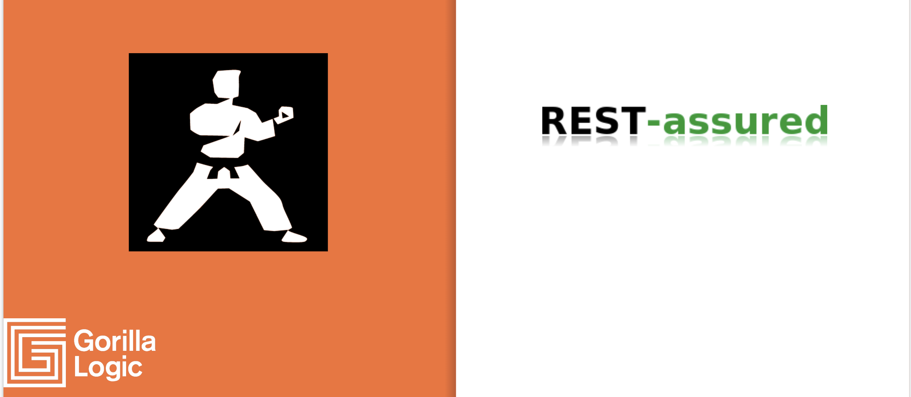
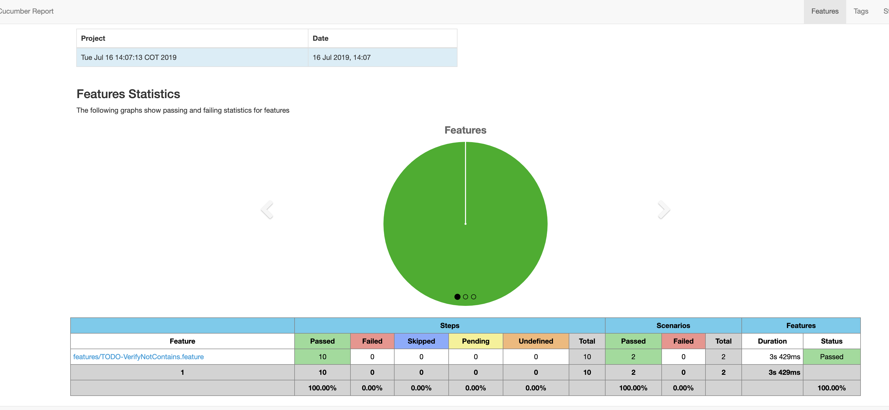
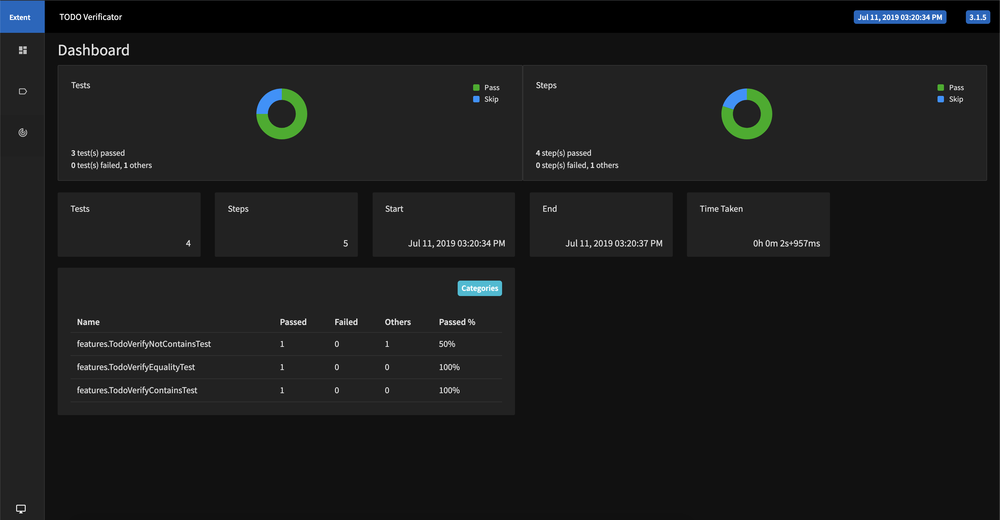

# Welcome to Karate vs Rest-Assured!


### `Postman is dead, Long live [Insert your pick here]`


## Motivation


Modern development stacks are becoming increasingly reliant on splitting Backend development from FrontEnd development, this paradigm brings several improvements to development teams:

- Improved speed to market
- Isolated points of failure
- Multi-front deliveries
- API based products

Those improvements need new ways to manage aspects of the development cycle, like Product creation, API Testing, Security, Deployments and so on.

In this article I want to talk about one of the most powerful techniques that modern teams are using, API Testing. 

Backend Teams are creating API's at a blazing pace today, QA Engineers rely on tools like Postman to verify complete product functionalities using API endpoints. This approach gives a lot of benefits:

- Faster results: Teams can have quick feedback of the API in a matter of minutes.
- Scalability: Faster feedback allows team to deploy faster
- Visual Interface: GUI to simplify test creation.
- Higher Coverage: API Tests are more stable than UI tests, and also are more real-life than unit tests, so having a strong API testing suite is highly recommended.

But this approach brings a big problem, test creation becomes a responsibility of QA engineers alone. teams lose the power of having developers creating tests that are close to the source, with all of the knowledge the developer has over the API Endpoint.

We will talk about how to give back power to developers to test their own Endpoints and will face two of the most interesting API Testing tools in the market: **Karate** and **Rest-Assured**

## The Candidates

 [REST-Assured](http://rest-assured.io/) is one of the most established API testing tools in the market. It has a powerful Java Based API that leverages **Hamcrest** as the matcher tool and a simple set of methods that allows method chaining and **Pseudo-Gherkin** Syntax.

[Karate](https://intuit.github.io/karate/) in the other hand is a Gherkin Based API testing tool, ideal for quick prototyping and simpler testing that can become as deep as you want, includes a simple quickstart mode, integrated dashboards and other goodies that are dragging attention from the Testing community.
 
## Let's get our hands dirty

### Installation
For starters both projects need to have the `JVM` and `Maven` installed.

---
#### Karate
`Karate` is pretty straightforward, just download the [Karate-x.x.x.jar](https://github.com/intuit/karate/tree/master/karate-netty#standalone-jar) and you are done.

---
#### REST-Assured
`Rest-Assured` works pretty well with maven, so you can start a new project using any maven archetype and adding the following dependencies:

```xml
<dependencies>
        <dependency>
            <groupId>io.rest-assured</groupId>
            <artifactId>rest-assured</artifactId>
            <version>${restassured.version}</version>
            <scope>test</scope>
        </dependency>
        <dependency>
            <groupId>junit</groupId>
            <artifactId>junit</artifactId>
            <version>${junit.version}</version>
            <scope>test</scope>
        </dependency>
        <dependency>
            <groupId>com.fasterxml.jackson.core</groupId>
            <artifactId>jackson-databind</artifactId>
            <version>${jackson.databind.version}</version>
            <scope>test</scope>
        </dependency>
```

A full `pom.xml` file is located into the `rest-assured` folder

Execute `mvn compile` and all of the dependencies will be downloaded

### The Tests
We will have both frameworks verify the same application, using the same tests.

Our `Application Under Test` will be [JSONPlaceHolder](https://jsonplaceholder.typicode.com/todos/1), which offers a simple REST API for testing.
  
  - The API returns a hardcoded list of TODO's
  - We will verify the first TODO and the most common operations available:
- - Equality
- - Contains and Not Contains

---

`Karate - Equality`
```gherkin
Feature: TODO API Verificator

Background:
    * url 'https://jsonplaceholder.typicode.com/todos/1'

Scenario: Verify First Todo is equals to "delectus aut autem"
    Given request
    When method get
    Then status 200   
    And match response == { userId: 1, id: 1, title: "delectus aut autem", completed: false } # Karate offers full JSON Comparison out of the box

 Scenario: Verify First Todo is equals to the sum of its parts
    Given request
    When method get
    Then status 200    
    And match response.userId == 1
    And match response.id == 1
    And match response.title == "delectus aut autem"
    And match response.completed == false # Also offers the standard comparison by element
   
```

`REST_assured - Equality`
```java
private String url = "https://jsonplaceholder.typicode.com/todos/1";
    @Test
    public void verifyFirstTodoIsEqualToTheSumOfItsParts() {
        given()
        .when()
            .get(url). // Yay, Gherkin
        then()
            .assertThat().body("userId", equalTo(1))
            .and().statusCode(200)
            .and().body("id", equalTo(1))
            .and().body("title", equalTo("delectus aut autem"))
            .and().body("completed", equalTo(false))
            ;
    }
    // Unfortunately, there is no built-in way to compare a whole JSON in Rest-Assured, yet the Gherkin Syntax included allows for a powerful matching logic
```

---
`Karate - Contains`
```gherkin
Feature: TODO API Verificator

Background:
    * url 'https://jsonplaceholder.typicode.com/todos/1'

Scenario: Verify First Todo title contains "delectus"
    Given request
    When method get
    Then status 200    
    And match response contains { title: "#regex ^(\\w+[delectus]).+"} # Supports regex out of the box

```

`REST_assured - Contains`
```java
 private String url = "https://jsonplaceholder.typicode.com/todos/1";
    @Test
    public void verifyTitleContainsDelectus() {
        given()
        .when()
            .get(url).
        then()
            .assertThat().statusCode(200)
            .and().body("title", containsString("delectus")) // Hamcrest Matchers, no need for regex
            ;
    }
```
  
  ---

`Karate - Not contains value`
```gherkin
Feature: TODO API Verificator

Background:
    * url 'https://jsonplaceholder.typicode.com/todos/1'

Scenario: Verify First Todo title field does not contain lorem
    Given request
    When method get
    Then status 200    
    And match response contains { title: "#regex ^((?!lorem).)*$"}  # Regex to verify value is not contained

```

`REST_assured - Not contains value`
```java
 private String url = "https://jsonplaceholder.typicode.com/todos/1";
    @Test
    public void verifyTitleNotContainsLoremIpsum() {
        given()
        .when()
            .get(url).
        then()
            .assertThat().statusCode(200)
            .and().body("title", not(containsString("lorem ipsum"))) // Use the compound matcher not()
            ;
    }
```

  ---

`What if we want to verify that an element is not part of the repsonse`

`Karate - Not contains ELEMENT`
```gherkin
Feature: TODO API Verificator

Background:
    * url 'https://jsonplaceholder.typicode.com/todos/1'

Scenario: Verify First Todo does not contains author field
    Given request
    When method get
    Then status 200    
    And match response.author == '#notpresent' 
    
    # Built-In Mechanism to verify for element existente
```

`REST_assured - Not contains ELEMENT`
```java
 private String url = "https://jsonplaceholder.typicode.com/todos/1";
    @Test
    public void verifyResponseDoesNotContainAuthor() {
		given()
        .when()
            .get(url).
        then()
            .assertThat().statusCode(200)
            .and().body( "any { it.key == 'author'}", is(false)) // Use JSONPath to verify element existence
            ;
    }
```

## The results

---
To execute `Karate's` feature files:
- Place all Feature Files in a directory called `features`
- e.g `features\TODO-verifyNotContains.feature`
- then execute: `java -jar Karate-x.x.x.jar features\TODO-verifyNotContains.feature`

Karate has a built in reporting tool, powered by Cucumber that gives you the result of the tests



---
To execute `Rest-Assured` tests:
- `Rest-Assured` leverages JUnit or TestNG as test runners.
- Place all the Test files into the `src\test\java` folder
- open a terminal in the root folder and execute `mvn clean compile test`
- By default Rest-Asssured does not include a Nice reporting tool. yet:




We can use the powerful `Extent Framework` to have beautiful reports.

We will talk about that in our `next article`.

## The recommendations

As we have seen both testing tools have their strengths and weaknesses, and each one can easily empower your team. I will try to give you some quick notes on each framework:

Use **Karate** when:

- You want a **quickstart** to do API Tests, without major hassle
- Your team doesn't have **Java background**, or want to work with **Gherkin**
- You have your Product Owners empowered in code and can write some tests in Gherkin
- You are comfy enough with the standard reports, and don't want to put time in enhanced reporting


Use **REST-Assured** when:

- Your team has a good **Java Expertise**
- You want to give more responsibility over test creation to developers (Improving the quality assistance methodology)
- You need/want to use improved matchers offered by **Hamcrest**
- Your API needs you to know intricate logic that is easier to write in Java

## The repo

All of the tests, and code examples can be found in this repo:

[Karate vs Rest-Assured](https://github.com/gorillalogic/karate-rest_assured)

The [Karate](https://github.com/gorillalogic/karate-rest_assured/tree/master/karate) Folder contains all of the feature files used during the example, and also the Karate.jar binary file for quickstart.

The [Rest-Assured](https://github.com/gorillalogic/karate-rest_assured/tree/master/rest-assured) folder contains a quick Maven project to start testing using Rest-Assured and also all of the examples we saw during this article.